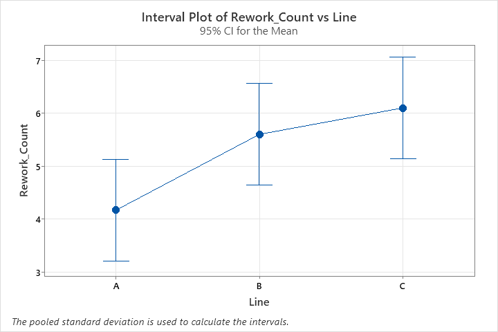

# Door Panel Quality Project 🚗

This project demonstrates a full Quality Engineering Analysis of a door panel rework problem in the automotive industry.
The study applies core quality tools following IATF 16949 and APQP framework.

## Contents

### 📊 Descriptive Statistics & Box Plot Analysis

### 📉 Pareto Analysis

### 📈 Control Charts (U-Chart)

### 🧪 ANOVA (Analysis of Variance)

### 🔧 Gage R&R Study (Measurement System Analysis)

### ⚠️ FMEA (Failure Mode and Effects Analysis)

| Process Step     | Failure Mode   | Effect                 | S | O | D | RPN | Recommended Action                  | S' | O' | D' | New RPN |
| ---------------- | -------------- | ---------------------- | - | - | - | --- | ----------------------------------- | -- | -- | -- | ------- |
| Fit Door Panel   | Misalignment   | Poor door closing      | 7 | 6 | 5 | 210 | Improve fixture, alignment tool     | 6  | 3  | 2  |  36     |
| Fasten Bolts     | Loose fastener | Vibration/noise        | 6 | 5 | 6 | 180 | Use calibrated torque wrench        | 5  | 2  | 3  |  30     |
| Wire Connections | Wrong wiring   | Electrical malfunction | 8 | 7 | 4 | 224 | Label wires clearly, staff training | 7  | 2  | 2  |  28     |

### 📑 Control Plan

| No | Process Step     | Product/Process Characteristic   | Specification/ Tolerance            | Measurement Method                 | Sample Size/Frequency | Control Method                   | Reaction Plan                          |
| -- | ---------------- | -------------------------------- | ----------------------------------- | ---------------------------------- | --------------------- | -------------------------------- | -------------------------------------- |
| 1  | Fit Door Panel   | Door alignment                   | ≤ ±2 mm gap between panel and frame | Visual + gap gauge                 | 100%                  | Fixture + SOP                    | Stop line, retrain operator            |
| 2  | Fasten Bolts     | Torque on bolts                  | 15 ± 1 Nm                           | Torque wrench with digital readout | 1 per car             | Calibration log + poka-yoke tool | Replace tool, recheck last 10 vehicles |
| 3  | Wire Connections | Connector seating & color coding | Fully seated and color matched      | Visual + click sound + color check | 100%                  | SOP board + labeling + training  | Stop assembly, QA recheck              |

### ✅ PPAP Documentation

- PPAP ensures that suppliers meet customer requirements for automotive production parts.  
  It consists of 18 elements, such as Process Flow, PFMEA, Control Plan, MSA, and PSW.  

### 📏 Process Capability Analysis

### 🎯 DOE (Design of Experiments)

DOE – Main Effects Plot

DOE – Interaction Plot

### 🐟 Fishbone Diagram

## Tools Used

- **Minitab** for statistical analysis

- **Excel** for dataset preparation

## Key Takeaways

- Identified major root causes of door panel rework (scratches, loose fasteners, wiring).

- Confirmed measurement system reliability with Gage R&R.

- Built a Control Plan & FMEA to prevent failures.

- Prepared a mini PPAP package for supplier approval.

## 📄 Project Files

📕 [Download Full Report (PDF)](./Final_Report.pdf)

## Learnings & Impact

- Strengthened ability to apply APQP & IATF 16949 in real-world projects.

- Improved skills in statistical tools (Minitab, Excel).

- Gained hands-on exposure to building structured quality documentation.

## Author

👤 Prepared by Shrey

🚀 Open to Automotive Quality Engineering & Process Improvement roles
