Door Panel Quality Project 🚗

This project demonstrates a full Quality Engineering Analysis of a door panel rework problem in the automotive industry.
The study applies core quality tools following IATF 16949 and APQP framework.

Contents

### 📊 Descriptive Statistics & Box Plot Analysis

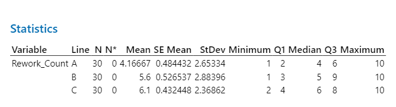

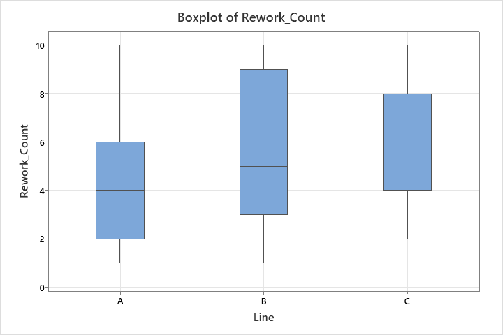

### 📉 Pareto Analysis

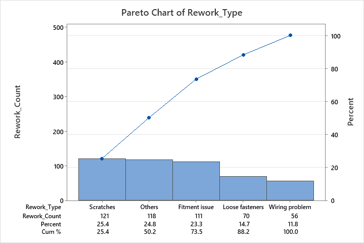

### 📈 Control Charts (U-Chart)

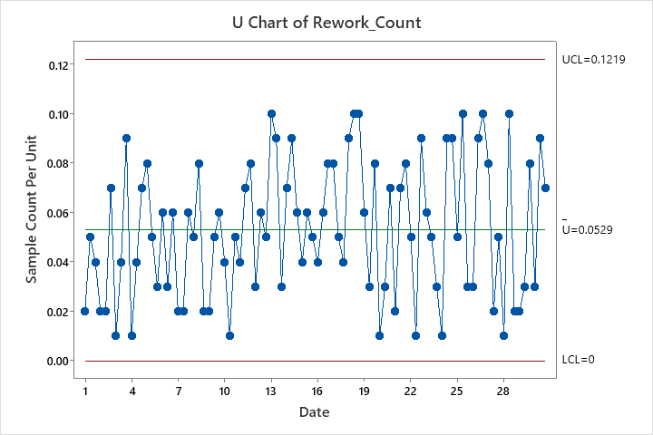

### 🧪 ANOVA (Analysis of Variance)

### 🔧 Gage R&R Study (Measurement System Analysis)

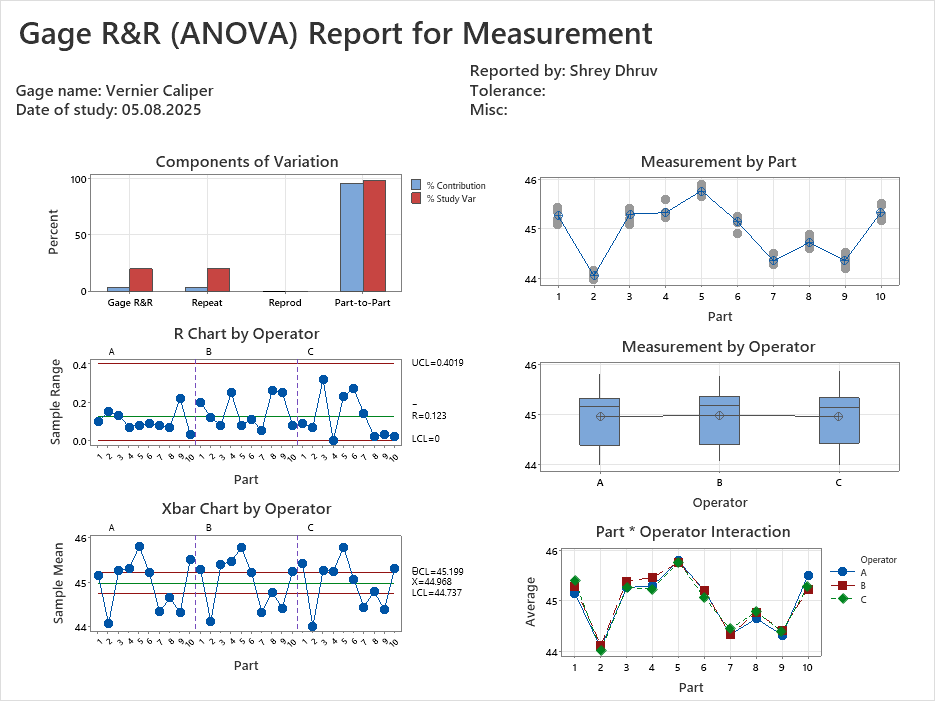

### ⚠️ FMEA (Failure Mode and Effects Analysis)

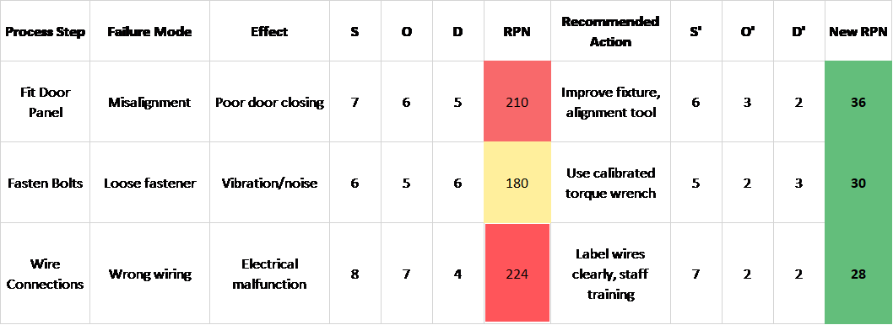

### 📑 Control Plan

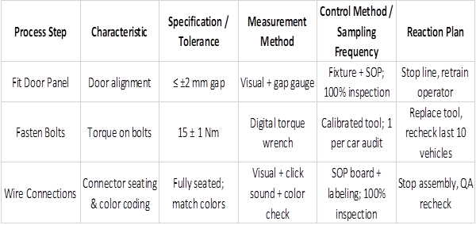

### ✅ PPAP Documentation

### 📏 Process Capability Analysis

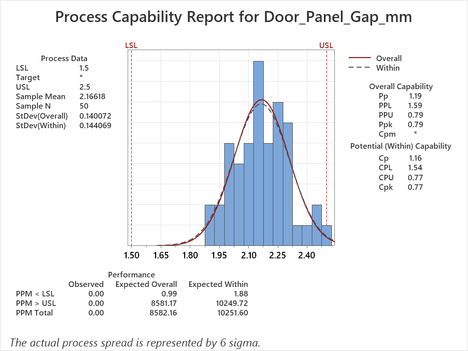

### 🎯 DOE (Design of Experiments)

DOE – Main Effects Plot

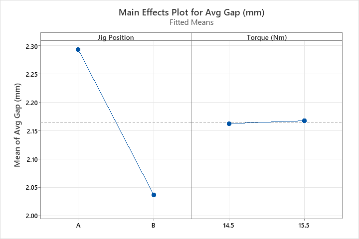

DOE – Interaction Plot

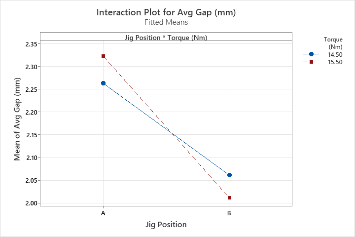

### 🐟 Fishbone Diagram

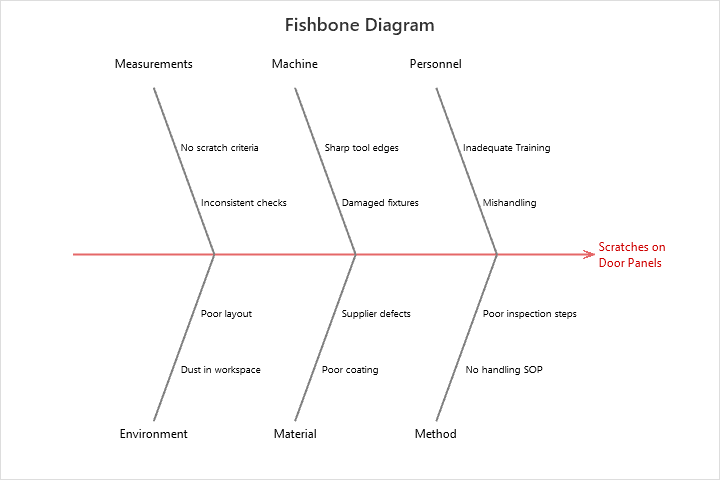

### Tools Used

Minitab for statistical analysis

Excel for dataset preparation

### Key Takeaways

Identified major root causes of door panel rework (scratches, loose fasteners, wiring).

Confirmed measurement system reliability with Gage R&R.

Built a Control Plan & FMEA to prevent failures.

Prepared a mini PPAP package for supplier approval.

### 📄 Project Files

📕 [Download Full Report (PDF)](./Final_Door_Panel_Project.pdf)

### Learnings & Impact

Strengthened ability to apply APQP & IATF 16949 in real-world projects.

Improved skills in statistical tools (Minitab, Excel).

Gained hands-on exposure to building structured quality documentation.

### Author

👤 Prepared by Shrey

🚀 Open to Automotive Quality Engineering & Process Improvement roles
